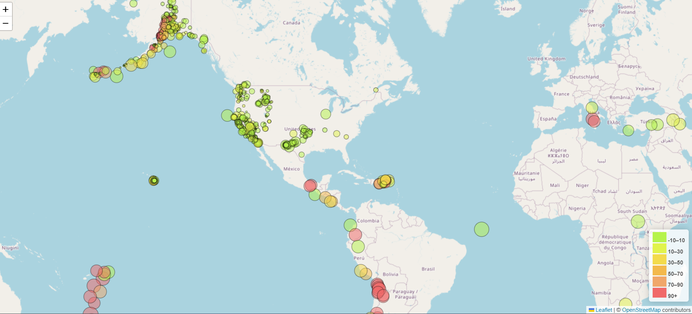

# leaflet_challenge

The United States Geological Survey (USGS) is interested in building a new set of tools that will allow them to visualize their earthquake data. In this challenge, our task is to visualize USGS data that will allow them to better educate the public and other government organizations (and hopefully secure more funding) on issues facing our planet.

we used  https://earthquake.usgs.gov/earthquakes/feed/v1.0/geojson.php to visualise all the data from last 7 days. The data is in GeoJSON format. The static folder has the logic.js that
 contains all the java script code, 
 d3 library has been used to load the data. 
 The size of the circles displays the earthquake magnitude and the colour of the circles shows the depth of the earthquake. A legend is also displayed to show the range of depth and corresponding colour.
 
 The index.html, static/js/logic.js and static/css/style.css files required to create the map. open the index.html in browser to view the map, or visit https://malihaspk.github.io/leaflet_challenge/
 
 
  

